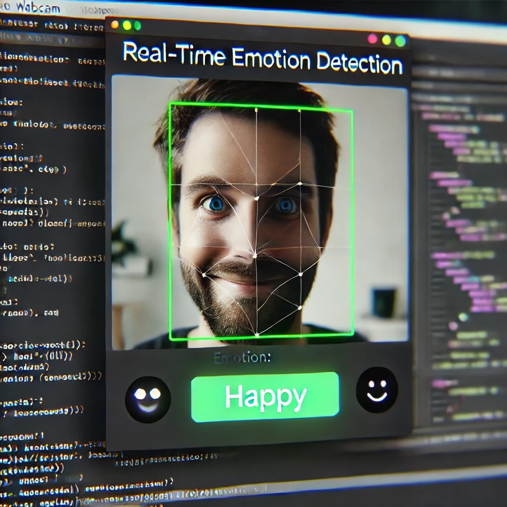

<h3>Emotion Recognition with OpenCV and DeepFace</h2>

This code uses the DeepFace library and OpenCV to detect facial emotions from the camera. Here is a step-by-step explanation of how the code works:

Explanation of the code function:
where cv2 is for image processing and camera usage
and DeepFace is for face analysis and emotion recognition

To activate the camera:
Using cv2.VideoCapture(0), the laptop camera or webcam is activated.

Create variables related to emotions: Three variables sad, happy, and angry to count the number of times each emotion is detected.

The emotion processing and recognition loop processes the image received from the camera:
Detects the dominant emotion using DeepFace.analyze().
The detected emotion is displayed on the image.
If the detected emotion is sad, happy, or angry, the value of the corresponding variable is increased by one.

To exit the program:
If the user presses the 'q' key, the program will stop and statistics about the detected emotions will be displayed in the terminal.

